# Palmyst — Backend Workflow Documentation

> Generated: 2026-03-12 | Stack: Supabase (PostgreSQL 17) · Deno Edge Functions · Anthropic Claude · Stripe · RevenueCat

---

## Table of Contents

1. [Backend System Overview](#1-backend-system-overview)
2. [High-Level Architecture](#2-high-level-architecture)
3. [API Request Lifecycle](#3-api-request-lifecycle)
4. [API Endpoints Workflow](#4-api-endpoints-workflow)
5. [Backend Function Execution Flow](#5-backend-function-execution-flow)
6. [Database Workflow](#6-database-workflow)
7. [Background Processes and Triggers](#7-background-processes-and-triggers)
8. [External Service Integration](#8-external-service-integration)
9. [Error Handling and Recovery Logic](#9-error-handling-and-recovery-logic)
10. [Data Flow Through the System](#10-data-flow-through-the-system)

---

## 1. Backend System Overview

Palmyst is a palm-reading and self-discovery mobile application. Users upload palm photos that are analysed by AI (Anthropic Claude) to generate insights across six life categories: **Relationship, Finance, Career, Health, Growth, and Personal Life**.

**Responsibilities of the backend:**

| Layer | Technology | Responsibility |
|---|---|---|
| Database | PostgreSQL 17 (Supabase) | All persistent data; 23 tables with strict RLS |
| Auth | Supabase Auth (JWT) | Identity, session tokens, signup triggers |
| Business Logic | SQL triggers + RPC functions | Credits, refunds, notifications, action plans |
| Edge Functions | Deno (TypeScript) | AI analysis, chat, payment webhooks |
| AI Analysis | Anthropic Claude Opus 4.6 | Palm image reading and insight generation |
| AI Chat | Anthropic Claude Haiku 4.5 | Context-aware conversational assistant |
| Payments | Stripe + RevenueCat webhooks | Credit pack purchases |
| Storage | Supabase Storage | Palm image file hosting |
| REST API | PostgREST (auto-generated) | CRUD operations on all tables |

The backend is **serverless by design**: there is no persistent application server. Every request is handled either by PostgREST (auto-generated REST from schema), an RPC function (a PostgreSQL function callable via REST), or a Deno Edge Function.

---

## 2. High-Level Architecture

### System Architecture Diagram

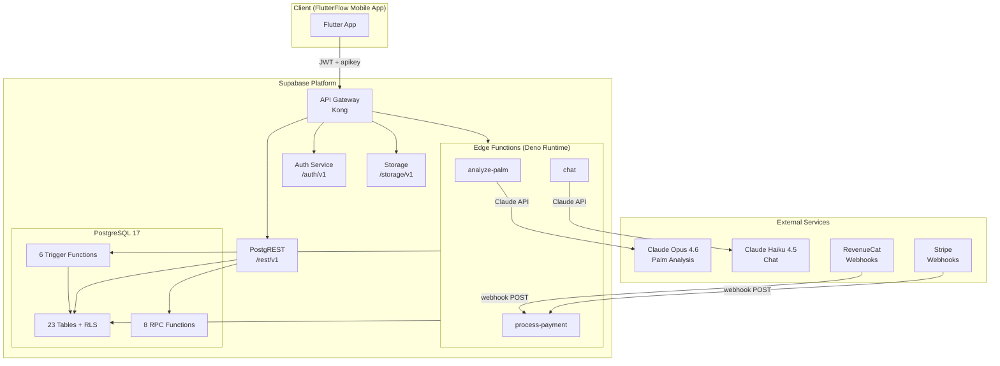

### Component Interactions

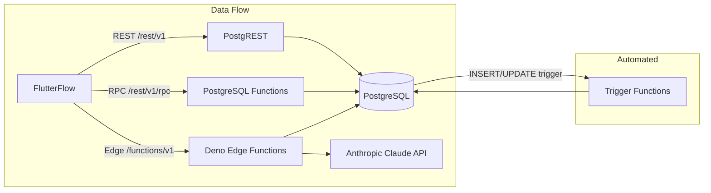

---

## 3. API Request Lifecycle

Every API call from the FlutterFlow app passes through the same Supabase gateway and follows this lifecycle:

### Standard REST Request Flow

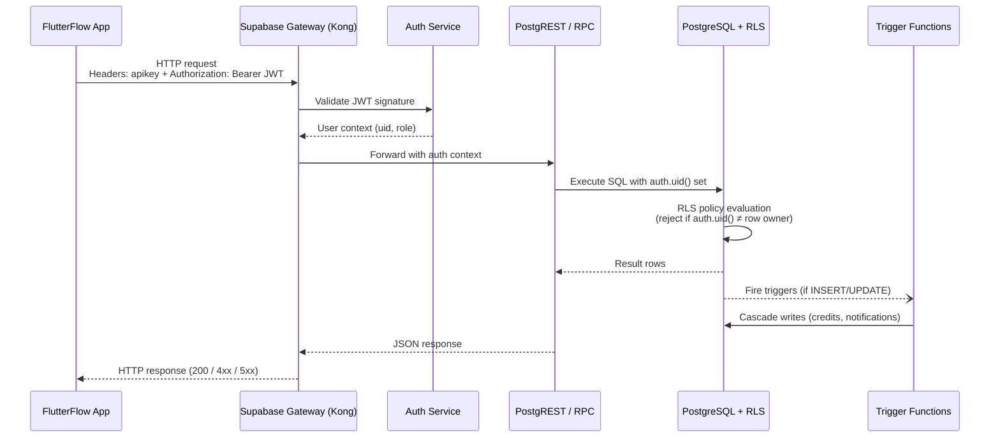

### Step-by-Step Breakdown

| Step | Location | What Happens |
|---|---|---|
| 1. Request Received | Kong Gateway | Validates `apikey` header. Rejects if missing. |
| 2. JWT Verification | Supabase Auth | Decodes Bearer token, extracts `auth.uid()` and `role`. Unauthenticated = `anon` role. |
| 3. Route Dispatch | Kong | Routes to PostgREST (`/rest/v1`), Auth (`/auth/v1`), Storage (`/storage/v1`), or Edge Function (`/functions/v1`). |
| 4. RLS Evaluation | PostgreSQL | Every SQL statement evaluated against RLS policies. `auth.uid()` must match `user_id` on user-owned rows. |
| 5. Business Logic | SQL / Edge Function | CRUD or RPC function executes. Edge functions run custom Deno code. |
| 6. Trigger Cascade | PostgreSQL | Triggers fire automatically on INSERT/UPDATE (credits, notifications, plan init). |
| 7. Response | PostgREST / Edge Function | Serialised JSON returned to client. |

### Edge Function Request Flow

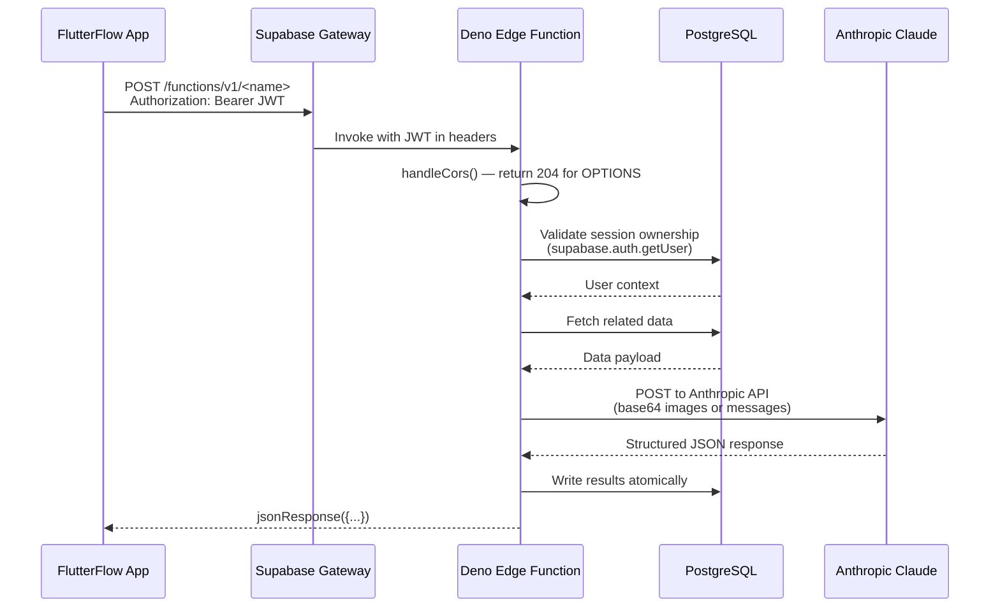

---

## 4. API Endpoints Workflow

### Base URLs

| Environment | URL |
|---|---|
| Local | `http://127.0.0.1:54321` |
| Production | `https://<project-ref>.supabase.co` |

### Standard Request Headers

```
apikey: <supabase-anon-key>
Authorization: Bearer <jwt-access-token>     # all authenticated requests
Content-Type: application/json               # mutations
Prefer: return=representation                # to get back the created/updated record
```

---

### 4.1 Authentication Endpoints (`/auth/v1`)

These are handled entirely by Supabase Auth — no custom code.

#### Sign Up
```
POST /auth/v1/signup
Body: { email, password, data: { full_name?, referred_by? } }
```

**Internal Flow:**
1. Supabase Auth creates `auth.users` row.
2. `handle_new_user()` trigger fires (AFTER INSERT on `auth.users`).
3. Trigger creates a `profiles` row with `credit_balance = 5` (welcome bonus).
4. If `referred_by` UUID provided and valid: grants 10 credits to the referrer + sends referrer a notification.
5. Returns: `{ access_token, refresh_token, user }`.

#### Sign In
```
POST /auth/v1/token?grant_type=password
Body: { email, password }
```
Returns JWT `access_token` (1 hour TTL) and `refresh_token` (long-lived).

#### Token Refresh
```
POST /auth/v1/token?grant_type=refresh_token
Body: { refresh_token }
```

---

### 4.2 Profile Endpoints (`/rest/v1/profiles`)

#### Get My Profile
```
GET /rest/v1/profiles?select=*&id=eq.<user_id>
```
RLS: Only own row visible (`auth.uid() = id`).

Returns: `credit_balance`, `preferred_language_id`, `referred_by`, `created_at`, etc.

#### Update Profile
```
PATCH /rest/v1/profiles?id=eq.<user_id>
Body: { full_name?, avatar_url?, preferred_language_id?, ... }
```
Triggers `set_updated_at()` automatically.

---

### 4.3 Palm Endpoints (`/rest/v1/palms`)

#### Create Palm
```
POST /rest/v1/palms
Body: { owner_id, label, image_url, is_self, gender, date_of_birth, hand_type }
```

**Constraints enforced by DB:**
- `is_self = true` is unique per `owner_id` (partial unique index).
- `image_url` must point to Supabase Storage.

#### Upload Palm Image (Storage)
```
POST /storage/v1/object/palm-images/<user_id>/<filename>
Body: binary image (JPEG/PNG/GIF/WebP)
```
Returns: `{ Key }` — used as `image_url` in the palm record.

---

### 4.4 Tool Session Workflow

This is the **core business flow**. It spans 3 API calls.

#### Step 1 — Start Session (RPC)
```
POST /rest/v1/rpc/start_tool_session
Body: { tool_id: uuid, palm1_id: uuid, palm2_id?: uuid }
```

**Internal flow of `start_tool_session()`:**
```
1. SELECT tool WHERE id = tool_id AND is_active = true  → 404 if not found
2. SELECT palm WHERE id = palm1_id AND owner_id = auth.uid()  → 403 if not owned
3. (if palm2_id) SELECT palm WHERE id = palm2_id AND owner_id = auth.uid()
4. internal_deduct_credits(auth.uid(), tool.credit_cost, 'tool_usage', ...)
   → checks credit_balance >= credit_cost; raises exception if insufficient
   → UPDATE profiles SET credit_balance -= credit_cost
   → INSERT credit_transactions (amount negative, type='tool_usage')
5. INSERT tool_sessions (status='pending', credits_used=credit_cost)
6. RETURN session_id
```

Returns: `uuid` (session_id)

#### Step 2 — Run AI Analysis (Edge Function)
```
POST /functions/v1/analyze-palm
Body: { session_id: uuid }
```
See [Section 5.1](#51-analyze-palm-edge-function) for full execution flow.

#### Step 3 — Fetch Results
```
GET /rest/v1/tool_sessions?id=eq.<session_id>&select=*,tool_session_metrics(*),session_solutions(*)
```
RLS ensures only session owner can read.

---

### 4.5 Solution Unlock (RPC)
```
POST /rest/v1/rpc/unlock_solution
Body: { session_id: uuid, solution_type: "traditional" | "science_backed" }
```

**Internal flow of `unlock_solution()`:**
```
1. SELECT session_solutions WHERE session_id = ? AND type = solution_type
   → via tool_sessions JOIN for ownership check
   → error if already unlocked
2. internal_deduct_credits(auth.uid(), 5, 'solution_unlock', ...)
3. UPDATE session_solutions SET is_unlocked=true, unlocked_at=now()
4. RETURN { id, content, is_unlocked, unlocked_at }
```

---

### 4.6 Chat Workflow

#### Create Chat Session
```
POST /rest/v1/chat_sessions
Body: { user_id, title?, tool_session_id? }
```

#### Send Message (Edge Function)
```
POST /functions/v1/chat
Body: { chat_session_id: uuid, message: string (max 2000 chars) }
```
See [Section 5.2](#52-chat-edge-function) for full execution flow.

#### Get Messages
```
GET /rest/v1/chat_messages?chat_session_id=eq.<id>&order=created_at.asc
```

---

### 4.7 Credits & Rewards (RPC)

#### Get Credit Balance + History
```
POST /rest/v1/rpc/get_my_credits
```
Returns: `{ balance: int, recent_transactions: [{ id, amount, type, description, balance_after, created_at }] }`
Last 20 transactions ordered by `created_at DESC`.

#### Record Share Reward
```
POST /rest/v1/rpc/record_share_reward
Body: { tool_id: uuid }
```
Rate-limited: once per tool per 24 hours. Grants 2 credits if eligible.

---

### 4.8 Review (RPC)
```
POST /rest/v1/rpc/submit_review
Body: { tool_id: uuid, rating: 1-5, review_text?: string, session_id?: uuid }
```
**Internal flow:**
```
1. INSERT INTO tool_reviews (upsert: one review per user per tool)
2. BEFORE INSERT trigger fn_grant_review_credits() fires:
   → If new review: internal_grant_credits(auth.uid(), 3, 'review_reward', ...)
3. RETURN { id, rating, credits_earned, is_new_review }
```

---

### 4.9 Action Plan Progression (RPC)
```
POST /rest/v1/rpc/advance_action
Body: { progress_id: uuid, feeling: reflection_feeling, notes?: string }
```
**Internal flow:**
```
1. UPDATE user_action_progress SET status='completed', feeling=?, notes=?
2. Find next action in sequence (order_index + 1) for same session
3. UPDATE next action SET status='available'
4. RETURN { completed: uuid, next: uuid, has_next: bool }
```

---

### 4.10 Payments (Edge Function / Webhook)
```
POST /functions/v1/process-payment
Headers: stripe-signature OR X-RevenueCat-Signature
Body: raw webhook payload
```
See [Section 5.3](#53-process-payment-edge-function) for full execution flow.

---

### 4.11 Notifications (RPC + REST)

#### List Notifications
```
GET /rest/v1/notifications?user_id=eq.<uid>&order=created_at.desc
```

#### Mark All Read (RPC)
```
POST /rest/v1/rpc/mark_all_notifications_read
```
Updates all `is_read = false` → `true` for `auth.uid()`. Returns count updated.

---

### 4.12 Catalogue Endpoints (Read-only)

All lookup data is SELECT-only via RLS for `authenticated` role.

| Endpoint | Data |
|---|---|
| `GET /rest/v1/categories` | 6 life categories |
| `GET /rest/v1/languages` | 8 languages |
| `GET /rest/v1/tools?is_active=eq.true` | All active tools |
| `GET /rest/v1/tools?is_featured=eq.true` | Featured tools |
| `GET /rest/v1/tool_features?tool_id=eq.<id>` | Tool feature bullets |
| `GET /rest/v1/subscription_plans?is_active=eq.true` | Credit packs |
| `GET /rest/v1/banners?is_active=eq.true&order=display_order.asc` | Active banners |

---

## 5. Backend Function Execution Flow

### 5.1 `analyze-palm` Edge Function

**Trigger:** `POST /functions/v1/analyze-palm`
**Runtime:** Deno
**AI Model:** Claude Opus 4.6

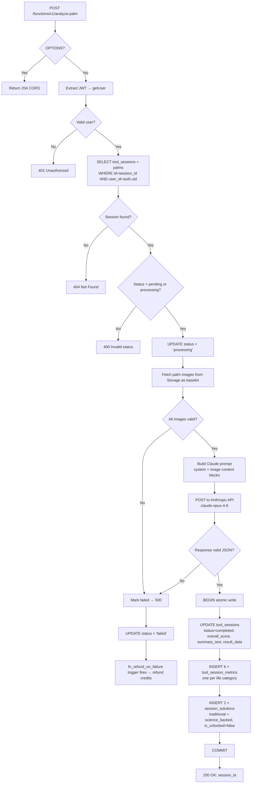

**Claude System Prompt Instructions (structured output):**
```
Return a JSON object with these exact fields:
{
  "overall_score": number (0-100),
  "summary_text": string (2-3 sentences),
  "metrics": [
    { "category": "Relationship|Finance|Career|Health|Growth|Personal Life",
      "score": number, "interpretation": string }
  ],
  "key_lines": { "heart": string, "head": string, "life": string, "fate": string },
  "mounts": { "venus": string, "jupiter": string, "saturn": string, "apollo": string, "mercury": string },
  "detailed_analysis": string,
  "traditional_advice": string,
  "science_backed_advice": string
}
```

**Error Handling:**
- Image fetch failure → session marked `failed`, credits refunded automatically via trigger
- Claude non-JSON response → session marked `failed`, credits refunded
- DB write failure → session marked `failed`, credits refunded

---

### 5.2 `chat` Edge Function

**Trigger:** `POST /functions/v1/chat`
**Runtime:** Deno
**AI Model:** Claude Haiku 4.5

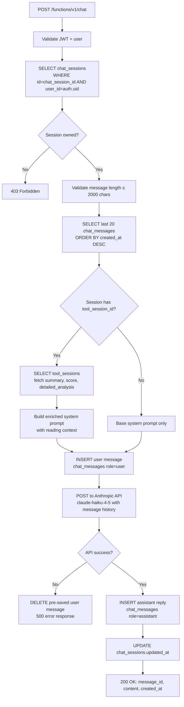

**System Prompt Structure:**
- Base: warm, empathetic palm reading assistant personality
- Context injection (if tool session linked and completed):
  - User's overall score
  - Session summary
  - Detailed analysis text

**Message History:** Last 20 messages sent to Claude as `messages[]` array (`user`/`assistant` roles).

---

### 5.3 `process-payment` Edge Function

**Trigger:** Webhook POST from Stripe or RevenueCat
**Runtime:** Deno

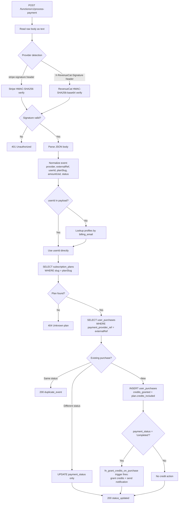

**Event Normalization (Stripe):**
- `checkout.session.completed` → status: `completed`
- `payment_intent.payment_failed` → status: `failed`
- `charge.refunded` → status: `refunded`

**Event Normalization (RevenueCat):**
- `INITIAL_PURCHASE`, `RENEWAL` → status: `completed`
- `BILLING_ISSUE` → status: `failed`
- `CANCELLATION` → status: `refunded`

---

### 5.4 RPC Functions Summary

| Function | Cost | Credits | Key Logic |
|---|---|---|---|
| `start_tool_session` | Deducts tool cost | -N | Validates tool + palm + balance; creates session |
| `unlock_solution` | -5 credits | -5 | Validates ownership + completion; sets is_unlocked |
| `submit_review` | None | +3 | Upsert review; trigger grants credits on first review |
| `advance_action` | None | 0 | Marks step done; unlocks next sequential step |
| `record_share_reward` | None | +2 | Rate-limited; 1 reward per tool per 24h |
| `get_my_credits` | None | Read-only | Balance + last 20 transactions |
| `validate_promo_code` | None | Read-only | Code validity + discount info |
| `mark_all_notifications_read` | None | 0 | Bulk update unread → read |

---

## 6. Database Workflow

### 6.1 Table Relationships

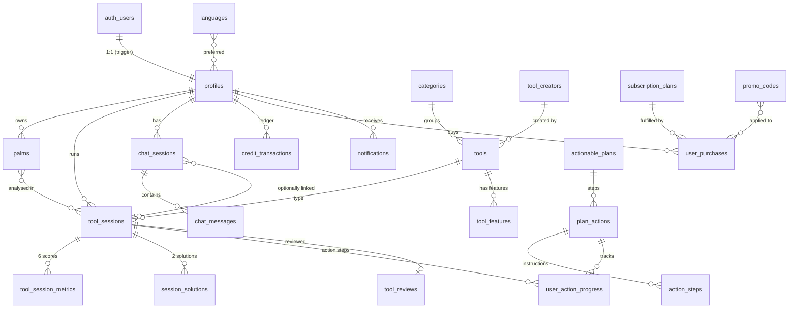

### 6.2 Credit Ledger Flow

Credits are stored in two places: the **running balance** (`profiles.credit_balance`) and an **immutable ledger** (`credit_transactions`). Both are updated atomically by `internal_deduct_credits()` and `internal_grant_credits()`.

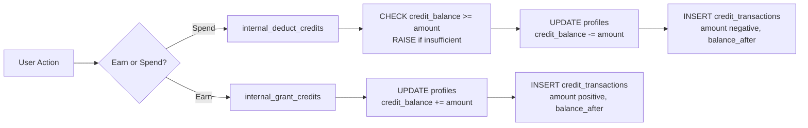

**Credit Sources:**

| Event | Amount | Type |
|---|---|---|
| Sign up | +5 | `signup_bonus` |
| Referral bonus (referrer) | +10 | `referral_bonus` |
| Submit review (new only) | +3 | `review_reward` |
| Share tool | +2 | `share_reward` |
| Purchase credit pack | +N | `purchase` |
| Admin grant | +N | `admin_grant` |
| Promo code | +N | `promo_bonus` |
| Use a tool | -N | `tool_usage` |
| Unlock solution | -5 | `solution_unlock` |
| Refund on failure | +N | `tool_refund` |

### 6.3 RLS Policies Summary

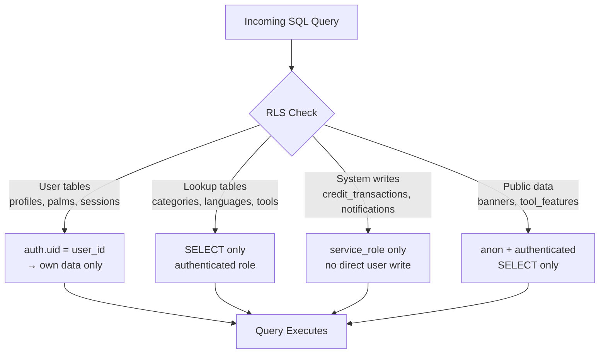

---

## 7. Background Processes and Triggers

All triggers are PostgreSQL trigger functions (`SECURITY DEFINER`) that fire automatically on table changes.

### 7.1 Trigger Map

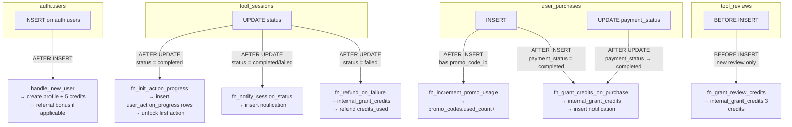

### 7.2 `handle_new_user()` — Signup Trigger

```sql
-- Fires: AFTER INSERT ON auth.users
1. Extract referred_by from raw_user_meta_data->>'referred_by'
2. INSERT INTO profiles (id=new.id, credit_balance=5)
3. INSERT INTO credit_transactions (type='signup_bonus', amount=5)
4. IF referred_by IS NOT NULL AND referred_by != new.id:
   a. internal_grant_credits(referred_by, 10, 'referral_bonus', ...)
   b. INSERT INTO notifications (user_id=referred_by, message='You earned 10 credits!')
```

### 7.3 `fn_init_action_progress()` — Action Plan Initialization

```sql
-- Fires: AFTER UPDATE ON tool_sessions WHERE status = 'completed'
1. Find actionable_plan linked to tool (tools.actionable_plan_id)
2. SELECT all plan_actions WHERE plan_id = ? ORDER BY order_index
3. FOR EACH action:
   INSERT INTO user_action_progress (user_id, session_id, plan_action_id, status)
   status = 'available' if order_index = 1 ELSE 'locked'
```

### 7.4 `fn_refund_on_failure()` — Credit Refund

```sql
-- Fires: AFTER UPDATE ON tool_sessions WHERE NEW.status = 'failed'
IF OLD.status != 'failed':
  internal_grant_credits(
    user_id = session.user_id,
    amount = session.credits_used,
    type = 'tool_refund',
    description = 'Refund for failed analysis',
    ref_id = session.id,
    ref_type = 'tool_sessions'
  )
```

### 7.5 `set_updated_at()` — Timestamp Maintenance

Applied to 15+ tables. Fires BEFORE UPDATE, sets `updated_at = now()` automatically.

---

## 8. External Service Integration

### 8.1 Anthropic Claude — Palm Analysis

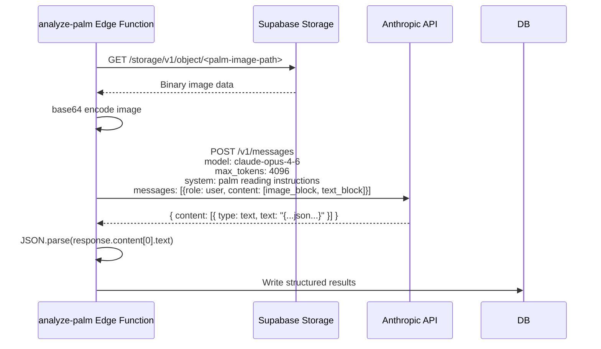

**API Call Parameters:**
```json
{
  "model": "claude-opus-4-6",
  "max_tokens": 4096,
  "system": "<palm reading system prompt>",
  "messages": [{
    "role": "user",
    "content": [
      { "type": "image", "source": { "type": "base64", "media_type": "image/jpeg", "data": "..." } },
      { "type": "text", "text": "Analyse this palm. Return JSON only." }
    ]
  }]
}
```

### 8.2 Anthropic Claude — Chat

```json
{
  "model": "claude-haiku-4-5-20251001",
  "max_tokens": 1024,
  "system": "<context-aware assistant prompt>",
  "messages": [
    { "role": "user", "content": "..." },
    { "role": "assistant", "content": "..." },
    ...
    { "role": "user", "content": "<new message>" }
  ]
}
```

### 8.3 Stripe — Payment Webhook

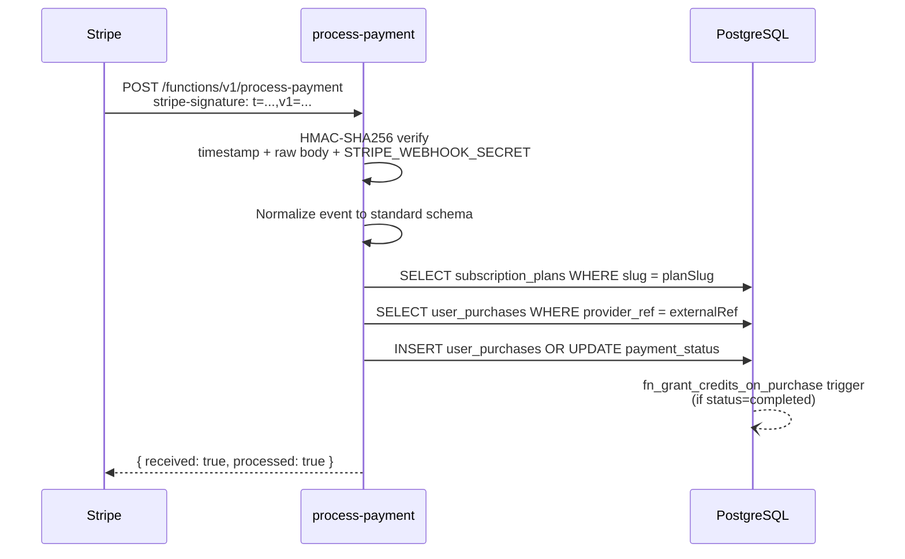

**Signature Verification (Stripe):**
```
signedPayload = timestamp + "." + rawBody
expectedSig = HMAC-SHA256(STRIPE_WEBHOOK_SECRET, signedPayload)
compare with v1=<signature> from header
```

### 8.4 RevenueCat — Payment Webhook

```
signature = HMAC-SHA256-base64(REVENUECAT_WEBHOOK_SECRET, rawBody)
compare with X-RevenueCat-Signature header
```

---

## 9. Error Handling and Recovery Logic

### 9.1 Edge Function Error Strategy

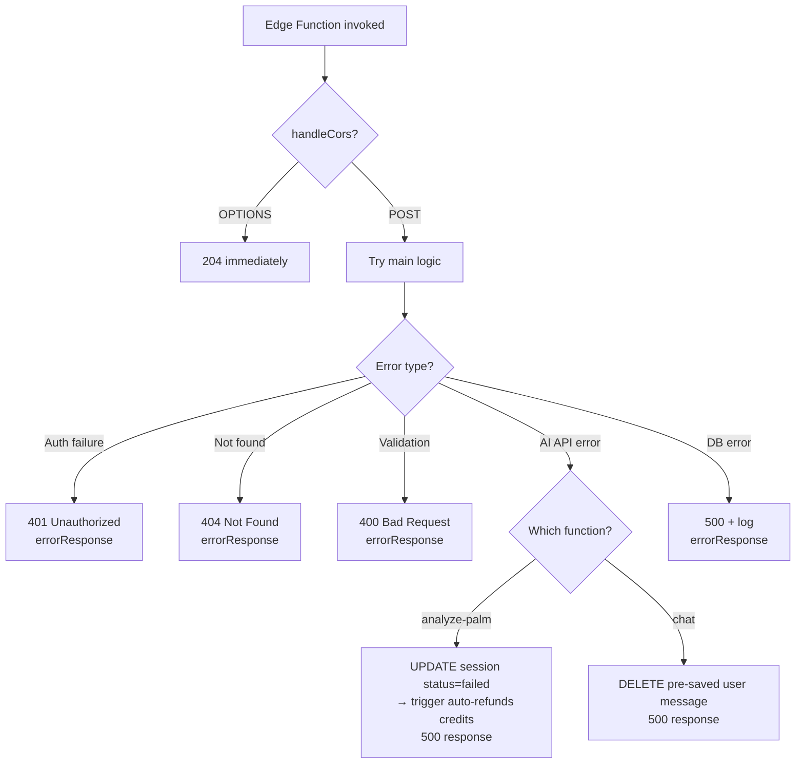

### 9.2 RPC Function Error Strategy

All RPC functions use `RAISE EXCEPTION` for error cases:
- PostgREST converts these to `HTTP 400` with `{ error: <message> }`.
- Transaction is fully rolled back on any exception.

| Error Condition | Exception Message | HTTP Code |
|---|---|---|
| Tool not found or inactive | `tool_not_found` | 400 |
| Palm not owned by user | `palm_not_found` | 400 |
| Insufficient credits | `insufficient_credits` | 400 |
| Session not completed | `session_not_completed` | 400 |
| Solution already unlocked | `already_unlocked` | 400 |
| Invalid promo code | `invalid_or_expired` | 400 (in JSON) |
| Rate limit exceeded (share) | `already_rewarded_today` | 200 (rewarded=false) |

### 9.3 Credit Refund on Failure

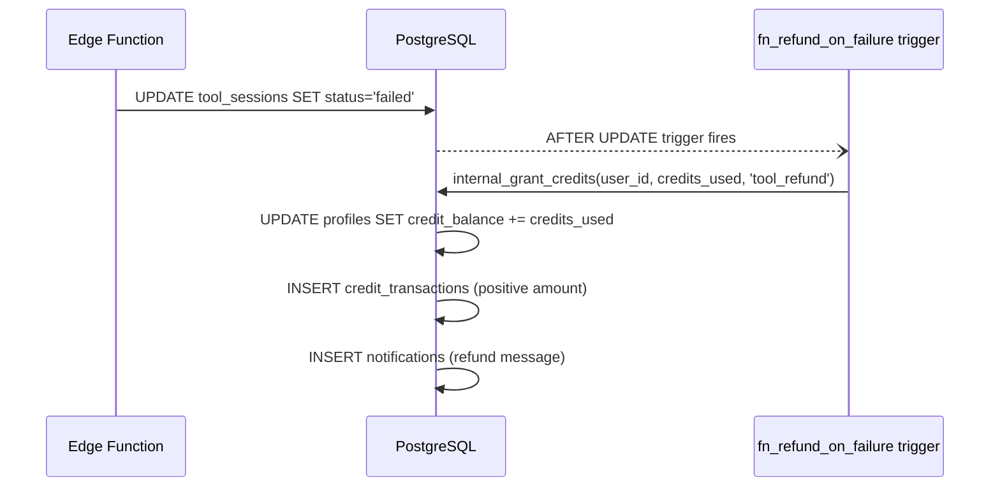

### 9.4 Payment Idempotency

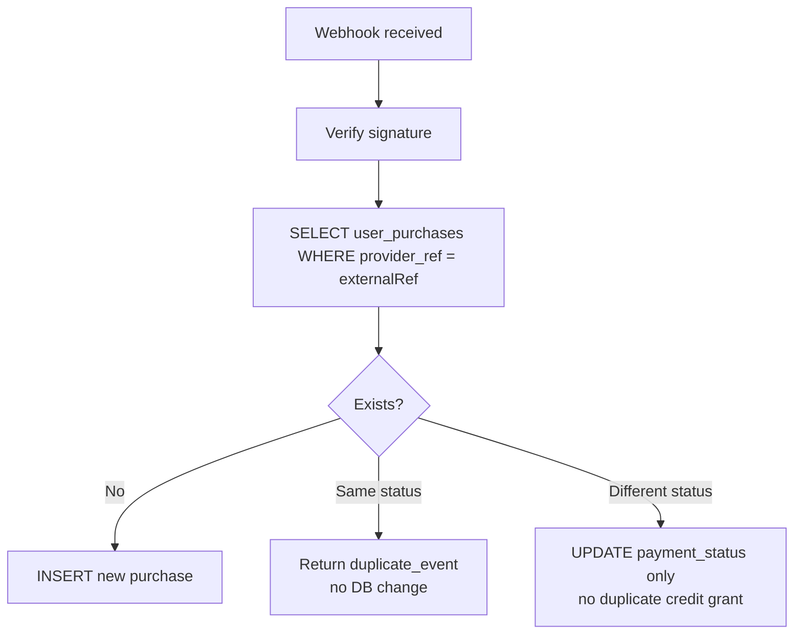

---

## 10. Data Flow Through the System

### 10.1 Complete Palm Analysis Flow

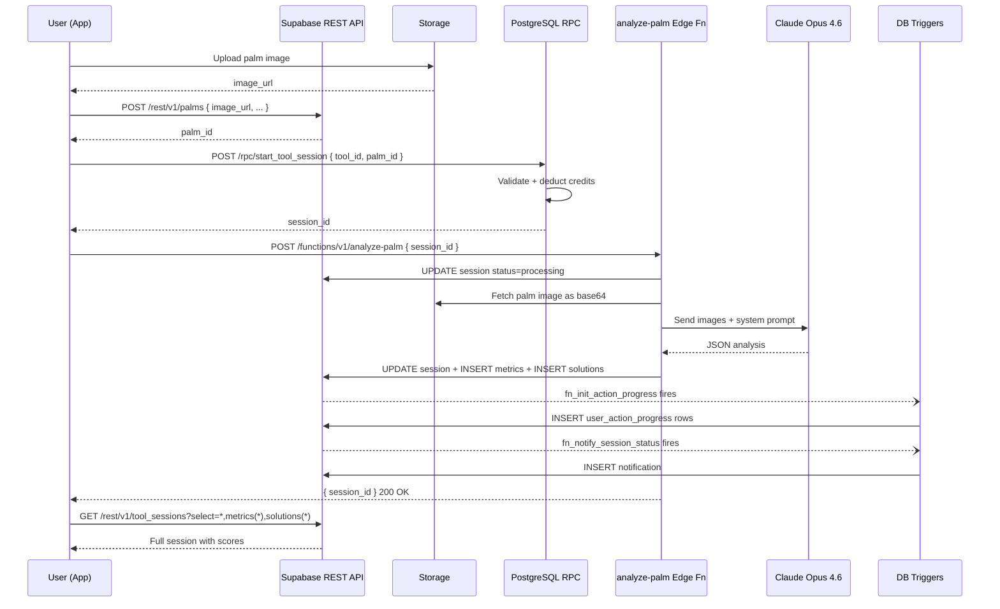

### 10.2 Chat with Context Flow

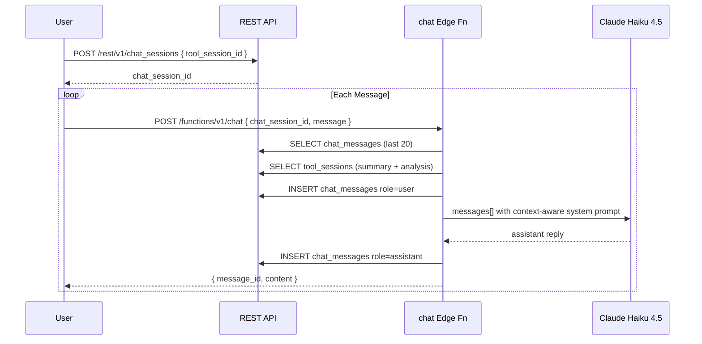

### 10.3 Credit Lifecycle Flow

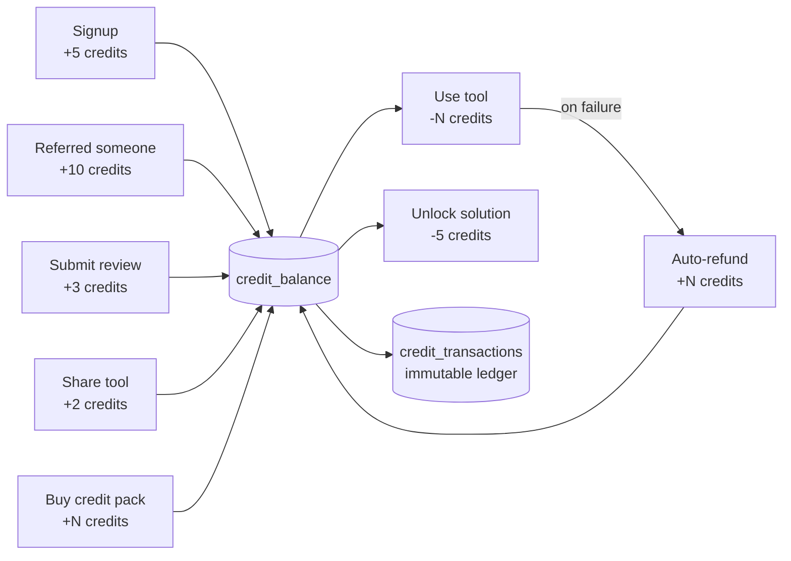

### 10.4 Payment-to-Credits Flow

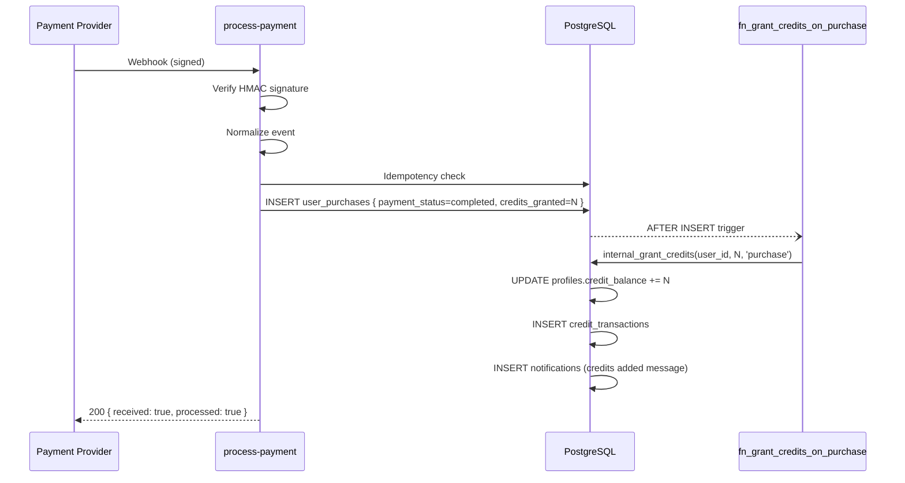

---

## Appendix: Environment Variables

| Variable | Used In | Purpose |
|---|---|---|
| `ANTHROPIC_API_KEY` | analyze-palm, chat | Authenticate with Anthropic API |
| `SUPABASE_URL` | All edge functions | Supabase project endpoint |
| `SUPABASE_ANON_KEY` | Client calls | Public API access |
| `SUPABASE_SERVICE_ROLE_KEY` | Edge functions | Bypass RLS for internal writes |
| `STRIPE_WEBHOOK_SECRET` | process-payment | Stripe signature verification |
| `REVENUECAT_WEBHOOK_SECRET` | process-payment | RevenueCat signature verification |

## Appendix: Key File Index

| File | Purpose |
|---|---|
| [supabase/migrations/20260306200001_palmyst_schema.sql](supabase/migrations/20260306200001_palmyst_schema.sql) | Core schema — 23 tables, ENUMs, RLS, indexes |
| [supabase/migrations/20260310000001_backend_logic.sql](supabase/migrations/20260310000001_backend_logic.sql) | Business logic — 8 RPC functions, 6 triggers |
| [supabase/functions/analyze-palm/index.ts](supabase/functions/analyze-palm/index.ts) | AI palm reading edge function |
| [supabase/functions/chat/index.ts](supabase/functions/chat/index.ts) | Conversational AI edge function |
| [supabase/functions/process-payment/index.ts](supabase/functions/process-payment/index.ts) | Payment webhook handler |
| [supabase/functions/_shared/cors.ts](supabase/functions/_shared/cors.ts) | CORS headers + OPTIONS handler |
| [supabase/functions/_shared/errors.ts](supabase/functions/_shared/errors.ts) | Error/JSON response helpers |
| [doc/db-schema.md](doc/db-schema.md) | Full ER diagram + table definitions |
| [API.md](API.md) | REST API reference (54+ endpoints) |
