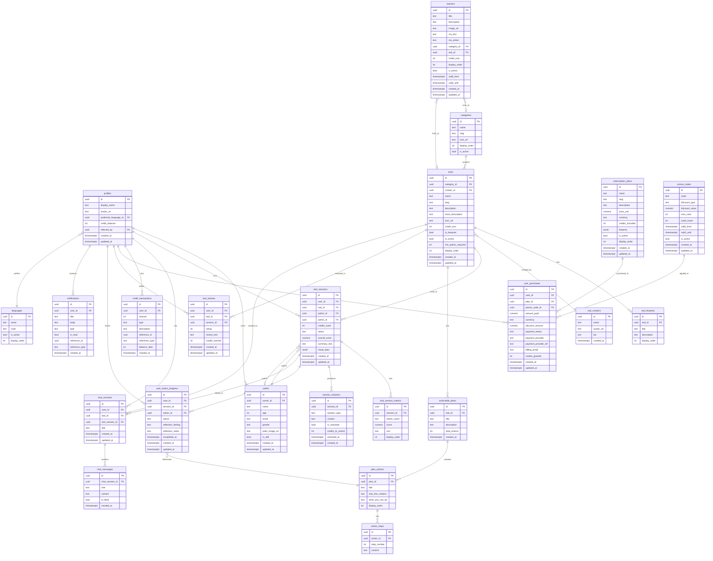

# Palmyst — Database Schema

> **Version:** 1.0.0
> **Backend:** Supabase (PostgreSQL 15+)
> **Frontend:** FlutterFlow
> **Last updated:** 2026-03-06

---

## Table of Contents

1. [Project Overview](#1-project-overview)
2. [Entity Relationship Overview](#2-entity-relationship-overview)
3. [ER Diagram (Mermaid)](#3-er-diagram-mermaid)
4. [Table Definitions](#4-table-definitions)
5. [Indexes](#5-indexes)
6. [Row Level Security (RLS) Policies](#6-row-level-security-rls-policies)
7. [Design Rationale](#7-design-rationale)
8. [Future Scalability Considerations](#8-future-scalability-considerations)

---

## 1. Project Overview

**Palmyst** is a palm-reading and self-discovery mobile application. Users upload photos of their palms, which are then analysed by AI-powered tools to generate insights across life categories (Relationship, Finance, Career, Health, Growth, Personal Life). The app features:

| Feature Area | Description |
|---|---|
| **Authentication** | Email/password, Google OAuth, Facebook OAuth |
| **Palm Management** | Users upload and manage multiple palm profiles (self + others) |
| **Tools** | Credit-gated AI tools organised by life category |
| **Tool Results** | Percentage scores, breakdowns, summary text |
| **Actionable Advice** | Sequential action plans tied to tool sessions |
| **Chat / Ask Anything** | Conversational AI per tool or general |
| **Credits System** | Earn on sign-up, reviews, shares; spend on tools; buy via in-app purchase |
| **Subscriptions** | Free / Basic / Premium one-time plans |
| **History** | Past tool sessions with participants and timestamps |
| **Reviews** | Users rate tools; earn credits for reviewing |
| **Notifications** | In-app notification feed |

---

## 2. Entity Relationship Overview

```
auth.users (Supabase managed)
    └── profiles                  ← 1:1 extension of auth user
            ├── palms              ← user manages N palm profiles
            ├── credit_transactions
            ├── user_purchases
            ├── tool_sessions      ← user runs N tool sessions
            │       ├── tool_session_metrics
            │       ├── session_solutions
            │       ├── user_action_progress
            │       └── tool_reviews
            ├── chat_sessions
            │       └── chat_messages
            └── notifications

categories
    └── tools
            ├── tool_features
            └── tool_creators (many-to-one)

subscription_plans
    └── user_purchases
            └── promo_codes (optional)

languages              ← lookup table
banners                ← CMS-style promotional content
```

---

## 3. ER Diagram (Mermaid)



---

## 4. Table Definitions

### 4.1 `languages`

Lookup table for supported app/content languages.

| Column | Type | Constraints | Description |
|---|---|---|---|
| `id` | `uuid` | PK, DEFAULT `gen_random_uuid()` | Unique identifier |
| `name` | `text` | NOT NULL | e.g., "English", "Hindi", "French" |
| `code` | `text` | NOT NULL, UNIQUE | ISO 639-1 code, e.g., "en", "hi", "fr" |
| `is_active` | `boolean` | NOT NULL, DEFAULT `true` | Controls visibility |
| `display_order` | `integer` | NOT NULL, DEFAULT `0` | Sort order in picker |

```sql
CREATE TABLE languages (
    id            uuid        PRIMARY KEY DEFAULT gen_random_uuid(),
    name          text        NOT NULL,
    code          text        NOT NULL UNIQUE,
    is_active     boolean     NOT NULL DEFAULT true,
    display_order integer     NOT NULL DEFAULT 0
);
```

---

### 4.2 `profiles`

Extends `auth.users`. Created automatically via a Supabase trigger on user sign-up.

| Column | Type | Constraints | Description |
|---|---|---|---|
| `id` | `uuid` | PK, FK → `auth.users(id)` ON DELETE CASCADE | Matches Supabase auth user ID |
| `display_name` | `text` | | Full name or display name |
| `avatar_url` | `text` | | Profile photo URL (Supabase Storage) |
| `preferred_language_id` | `uuid` | FK → `languages(id)` | User's chosen language |
| `credit_balance` | `integer` | NOT NULL, DEFAULT `0`, CHECK ≥ 0 | Current credit balance |
| `referred_by` | `uuid` | FK → `profiles(id)`, NULLABLE | Referrer's profile ID |
| `created_at` | `timestamptz` | NOT NULL, DEFAULT `now()` | Registration timestamp |
| `updated_at` | `timestamptz` | NOT NULL, DEFAULT `now()` | Last profile update |

```sql
CREATE TABLE profiles (
    id                     uuid        PRIMARY KEY REFERENCES auth.users(id) ON DELETE CASCADE,
    display_name           text,
    avatar_url             text,
    preferred_language_id  uuid        REFERENCES languages(id),
    credit_balance         integer     NOT NULL DEFAULT 0 CHECK (credit_balance >= 0),
    referred_by            uuid        REFERENCES profiles(id),
    created_at             timestamptz NOT NULL DEFAULT now(),
    updated_at             timestamptz NOT NULL DEFAULT now()
);
```

> **Supabase trigger:** Create a `handle_new_user()` trigger on `auth.users` INSERT to auto-insert into `profiles` and grant the sign-up credit bonus via `credit_transactions`.

---

### 4.3 `palms`

Palm profiles managed by a user. A user has at least one palm (themselves) and can add others (family, partner, etc.).

| Column | Type | Constraints | Description |
|---|---|---|---|
| `id` | `uuid` | PK, DEFAULT `gen_random_uuid()` | Unique identifier |
| `owner_id` | `uuid` | NOT NULL, FK → `profiles(id)` ON DELETE CASCADE | Owning user |
| `name` | `text` | NOT NULL | Display name for the palm owner |
| `age` | `integer` | CHECK (age > 0 AND age < 150) | Optional age |
| `email` | `text` | | Optional email for this person |
| `gender` | `text` | CHECK IN ('male','female','other','prefer_not_to_say') | Gender |
| `palm_image_url` | `text` | | Storage URL for dominant palm image |
| `is_self` | `boolean` | NOT NULL, DEFAULT `false` | True if this palm belongs to the owner themselves |
| `created_at` | `timestamptz` | NOT NULL, DEFAULT `now()` | |
| `updated_at` | `timestamptz` | NOT NULL, DEFAULT `now()` | |

```sql
CREATE TYPE gender_enum AS ENUM ('male', 'female', 'other', 'prefer_not_to_say');

CREATE TABLE palms (
    id              uuid        PRIMARY KEY DEFAULT gen_random_uuid(),
    owner_id        uuid        NOT NULL REFERENCES profiles(id) ON DELETE CASCADE,
    name            text        NOT NULL,
    age             integer     CHECK (age > 0 AND age < 150),
    email           text,
    gender          gender_enum,
    palm_image_url  text,
    is_self         boolean     NOT NULL DEFAULT false,
    created_at      timestamptz NOT NULL DEFAULT now(),
    updated_at      timestamptz NOT NULL DEFAULT now()
);
```

**Constraints:**
- Only one `is_self = true` palm allowed per user: `UNIQUE (owner_id) WHERE is_self = true`

---

### 4.4 `categories`

Life categories that group tools (Relationship, Finance, Career, Health, Growth, Personal Life).

| Column | Type | Constraints | Description |
|---|---|---|---|
| `id` | `uuid` | PK, DEFAULT `gen_random_uuid()` | |
| `name` | `text` | NOT NULL | Display name |
| `slug` | `text` | NOT NULL, UNIQUE | URL-safe identifier |
| `icon_url` | `text` | | Icon asset URL |
| `display_order` | `integer` | NOT NULL, DEFAULT `0` | Sort order |
| `is_active` | `boolean` | NOT NULL, DEFAULT `true` | |
| `created_at` | `timestamptz` | NOT NULL, DEFAULT `now()` | |
| `updated_at` | `timestamptz` | NOT NULL, DEFAULT `now()` | |

```sql
CREATE TABLE categories (
    id            uuid        PRIMARY KEY DEFAULT gen_random_uuid(),
    name          text        NOT NULL,
    slug          text        NOT NULL UNIQUE,
    icon_url      text,
    display_order integer     NOT NULL DEFAULT 0,
    is_active     boolean     NOT NULL DEFAULT true,
    created_at    timestamptz NOT NULL DEFAULT now(),
    updated_at    timestamptz NOT NULL DEFAULT now()
);
```

**Seed data:**

| slug | name |
|---|---|
| `relationship` | Relationship |
| `personal-life` | Personal Life |
| `health` | Health |
| `finance` | Finance |
| `career` | Career |
| `growth` | Growth |

---

### 4.5 `tool_creators`

The "Person behind this tool" — experts or practitioners credited for each tool.

| Column | Type | Constraints | Description |
|---|---|---|---|
| `id` | `uuid` | PK, DEFAULT `gen_random_uuid()` | |
| `name` | `text` | NOT NULL | Creator's full name |
| `avatar_url` | `text` | | Profile photo URL |
| `bio` | `text` | | Short biography displayed in tool intro |
| `created_at` | `timestamptz` | NOT NULL, DEFAULT `now()` | |
| `updated_at` | `timestamptz` | NOT NULL, DEFAULT `now()` | |

```sql
CREATE TABLE tool_creators (
    id          uuid        PRIMARY KEY DEFAULT gen_random_uuid(),
    name        text        NOT NULL,
    avatar_url  text,
    bio         text,
    created_at  timestamptz NOT NULL DEFAULT now(),
    updated_at  timestamptz NOT NULL DEFAULT now()
);
```

---

### 4.6 `tools`

The core AI-powered tools users can purchase and use with palm profiles.

| Column | Type | Constraints | Description |
|---|---|---|---|
| `id` | `uuid` | PK, DEFAULT `gen_random_uuid()` | |
| `category_id` | `uuid` | NOT NULL, FK → `categories(id)` | |
| `creator_id` | `uuid` | FK → `tool_creators(id)` | Optional: person behind the tool |
| `name` | `text` | NOT NULL | Display name (e.g., "Love Calculator") |
| `slug` | `text` | NOT NULL, UNIQUE | URL-safe identifier |
| `description` | `text` | | Full description shown on detail page |
| `short_description` | `text` | | Subtitle shown on card/grid |
| `icon_url` | `text` | | Tool icon |
| `credit_cost` | `integer` | NOT NULL, DEFAULT `1`, CHECK > 0 | Credits charged per use |
| `is_featured` | `boolean` | NOT NULL, DEFAULT `false` | Shown in "Featured Tools" row |
| `is_active` | `boolean` | NOT NULL, DEFAULT `true` | Hidden from users when false |
| `min_palms_required` | `integer` | NOT NULL, DEFAULT `1`, CHECK IN (1,2) | 1 = single palm; 2 = two people |
| `display_order` | `integer` | NOT NULL, DEFAULT `0` | Sort order within category |
| `created_at` | `timestamptz` | NOT NULL, DEFAULT `now()` | |
| `updated_at` | `timestamptz` | NOT NULL, DEFAULT `now()` | |

```sql
CREATE TABLE tools (
    id                  uuid        PRIMARY KEY DEFAULT gen_random_uuid(),
    category_id         uuid        NOT NULL REFERENCES categories(id),
    creator_id          uuid        REFERENCES tool_creators(id),
    name                text        NOT NULL,
    slug                text        NOT NULL UNIQUE,
    description         text,
    short_description   text,
    icon_url            text,
    credit_cost         integer     NOT NULL DEFAULT 1 CHECK (credit_cost > 0),
    is_featured         boolean     NOT NULL DEFAULT false,
    is_active           boolean     NOT NULL DEFAULT true,
    min_palms_required  integer     NOT NULL DEFAULT 1 CHECK (min_palms_required IN (1, 2)),
    display_order       integer     NOT NULL DEFAULT 0,
    created_at          timestamptz NOT NULL DEFAULT now(),
    updated_at          timestamptz NOT NULL DEFAULT now()
);
```

---

### 4.7 `tool_features`

Bullet-point feature descriptions shown on the tool introduction/detail screen.

| Column | Type | Constraints | Description |
|---|---|---|---|
| `id` | `uuid` | PK, DEFAULT `gen_random_uuid()` | |
| `tool_id` | `uuid` | NOT NULL, FK → `tools(id)` ON DELETE CASCADE | |
| `title` | `text` | NOT NULL | Feature headline |
| `description` | `text` | | Feature detail text |
| `display_order` | `integer` | NOT NULL, DEFAULT `0` | |

```sql
CREATE TABLE tool_features (
    id            uuid    PRIMARY KEY DEFAULT gen_random_uuid(),
    tool_id       uuid    NOT NULL REFERENCES tools(id) ON DELETE CASCADE,
    title         text    NOT NULL,
    description   text,
    display_order integer NOT NULL DEFAULT 0
);
```

---

### 4.8 `tool_sessions`

Records every time a user runs a tool. The core transactional entity linking users, palms, and tool results.

| Column | Type | Constraints | Description |
|---|---|---|---|
| `id` | `uuid` | PK, DEFAULT `gen_random_uuid()` | |
| `user_id` | `uuid` | NOT NULL, FK → `profiles(id)` ON DELETE CASCADE | |
| `tool_id` | `uuid` | NOT NULL, FK → `tools(id)` | |
| `palm1_id` | `uuid` | NOT NULL, FK → `palms(id)` | Primary palm |
| `palm2_id` | `uuid` | FK → `palms(id)`, NULLABLE | Second palm (for 2-person tools) |
| `credits_used` | `integer` | NOT NULL, CHECK > 0 | Credits deducted for this run |
| `status` | `text` | NOT NULL, DEFAULT `'pending'` | `pending`, `processing`, `completed`, `failed` |
| `overall_score` | `numeric(5,2)` | NULLABLE | Overall percentage score (0–100) |
| `summary_text` | `text` | | AI-generated summary paragraph |
| `result_data` | `jsonb` | | Full raw AI result payload |
| `created_at` | `timestamptz` | NOT NULL, DEFAULT `now()` | Session start |
| `updated_at` | `timestamptz` | NOT NULL, DEFAULT `now()` | Last status update |

```sql
CREATE TYPE session_status AS ENUM ('pending', 'processing', 'completed', 'failed');

CREATE TABLE tool_sessions (
    id            uuid           PRIMARY KEY DEFAULT gen_random_uuid(),
    user_id       uuid           NOT NULL REFERENCES profiles(id) ON DELETE CASCADE,
    tool_id       uuid           NOT NULL REFERENCES tools(id),
    palm1_id      uuid           NOT NULL REFERENCES palms(id),
    palm2_id      uuid           REFERENCES palms(id),
    credits_used  integer        NOT NULL CHECK (credits_used > 0),
    status        session_status NOT NULL DEFAULT 'pending',
    overall_score numeric(5,2),
    summary_text  text,
    result_data   jsonb,
    created_at    timestamptz    NOT NULL DEFAULT now(),
    updated_at    timestamptz    NOT NULL DEFAULT now(),
    CHECK (palm2_id IS NULL OR palm2_id <> palm1_id)
);
```

---

### 4.9 `tool_session_metrics`

Individual metric breakdowns shown in the tool result (e.g., "Emotional — 67%", "Physical — 67%").

| Column | Type | Constraints | Description |
|---|---|---|---|
| `id` | `uuid` | PK, DEFAULT `gen_random_uuid()` | |
| `session_id` | `uuid` | NOT NULL, FK → `tool_sessions(id)` ON DELETE CASCADE | |
| `metric_name` | `text` | NOT NULL | e.g., "Emotional", "Physical" |
| `score` | `numeric(5,2)` | NOT NULL | Score value (e.g., 67.00) |
| `unit` | `text` | DEFAULT `'%'` | Display unit |
| `display_order` | `integer` | NOT NULL, DEFAULT `0` | |

```sql
CREATE TABLE tool_session_metrics (
    id            uuid         PRIMARY KEY DEFAULT gen_random_uuid(),
    session_id    uuid         NOT NULL REFERENCES tool_sessions(id) ON DELETE CASCADE,
    metric_name   text         NOT NULL,
    score         numeric(5,2) NOT NULL,
    unit          text         DEFAULT '%',
    display_order integer      NOT NULL DEFAULT 0
);
```

---

### 4.10 `session_solutions`

Traditional and science-backed solutions generated per session, gated behind credit unlocking.

| Column | Type | Constraints | Description |
|---|---|---|---|
| `id` | `uuid` | PK, DEFAULT `gen_random_uuid()` | |
| `session_id` | `uuid` | NOT NULL, FK → `tool_sessions(id)` ON DELETE CASCADE | |
| `solution_type` | `text` | NOT NULL, CHECK IN ('traditional','science_backed') | Type of solution |
| `content` | `text` | NOT NULL | Solution advice text |
| `is_unlocked` | `boolean` | NOT NULL, DEFAULT `false` | Whether the user has unlocked this |
| `credits_to_unlock` | `integer` | NOT NULL, DEFAULT `0` | Cost to unlock |
| `unlocked_at` | `timestamptz` | NULLABLE | When the user unlocked it |
| `created_at` | `timestamptz` | NOT NULL, DEFAULT `now()` | |

```sql
CREATE TYPE solution_type AS ENUM ('traditional', 'science_backed');

CREATE TABLE session_solutions (
    id               uuid          PRIMARY KEY DEFAULT gen_random_uuid(),
    session_id       uuid          NOT NULL REFERENCES tool_sessions(id) ON DELETE CASCADE,
    solution_type    solution_type NOT NULL,
    content          text          NOT NULL,
    is_unlocked      boolean       NOT NULL DEFAULT false,
    credits_to_unlock integer      NOT NULL DEFAULT 0,
    unlocked_at      timestamptz,
    created_at       timestamptz   NOT NULL DEFAULT now(),
    UNIQUE (session_id, solution_type)
);
```

---

### 4.11 `actionable_plans`

A plan template of sequential actions associated with a tool (e.g., "Personality Analyser" has 8 actions).

| Column | Type | Constraints | Description |
|---|---|---|---|
| `id` | `uuid` | PK, DEFAULT `gen_random_uuid()` | |
| `tool_id` | `uuid` | NOT NULL, FK → `tools(id)` ON DELETE CASCADE | The tool this plan belongs to |
| `title` | `text` | NOT NULL | Plan title |
| `description` | `text` | | Summary description |
| `total_actions` | `integer` | NOT NULL, DEFAULT `0` | Denormalised count |
| `created_at` | `timestamptz` | NOT NULL, DEFAULT `now()` | |
| `updated_at` | `timestamptz` | NOT NULL, DEFAULT `now()` | |

```sql
CREATE TABLE actionable_plans (
    id            uuid        PRIMARY KEY DEFAULT gen_random_uuid(),
    tool_id       uuid        NOT NULL REFERENCES tools(id) ON DELETE CASCADE,
    title         text        NOT NULL,
    description   text,
    total_actions integer     NOT NULL DEFAULT 0,
    created_at    timestamptz NOT NULL DEFAULT now(),
    updated_at    timestamptz NOT NULL DEFAULT now()
);
```

---

### 4.12 `plan_actions`

Individual actions within an actionable plan, shown in the sequential step tracker.

| Column | Type | Constraints | Description |
|---|---|---|---|
| `id` | `uuid` | PK, DEFAULT `gen_random_uuid()` | |
| `plan_id` | `uuid` | NOT NULL, FK → `actionable_plans(id)` ON DELETE CASCADE | |
| `title` | `text` | NOT NULL | e.g., "Action 3" / actual action title |
| `why_this_matters` | `text` | | "Why This Matters?" section content |
| `what_you_can_do` | `text` | | "What You Can Do?" section content |
| `display_order` | `integer` | NOT NULL | Sequential order (1, 2, 3…) |

```sql
CREATE TABLE plan_actions (
    id                uuid    PRIMARY KEY DEFAULT gen_random_uuid(),
    plan_id           uuid    NOT NULL REFERENCES actionable_plans(id) ON DELETE CASCADE,
    title             text    NOT NULL,
    why_this_matters  text,
    what_you_can_do   text,
    display_order     integer NOT NULL,
    UNIQUE (plan_id, display_order)
);
```

---

### 4.13 `action_steps`

Step-by-step instructions under the "How to Practice It?" section of each action.

| Column | Type | Constraints | Description |
|---|---|---|---|
| `id` | `uuid` | PK, DEFAULT `gen_random_uuid()` | |
| `action_id` | `uuid` | NOT NULL, FK → `plan_actions(id)` ON DELETE CASCADE | |
| `step_number` | `integer` | NOT NULL | 1-based step index |
| `content` | `text` | NOT NULL | Instruction text |
| UNIQUE | | `(action_id, step_number)` | |

```sql
CREATE TABLE action_steps (
    id          uuid    PRIMARY KEY DEFAULT gen_random_uuid(),
    action_id   uuid    NOT NULL REFERENCES plan_actions(id) ON DELETE CASCADE,
    step_number integer NOT NULL,
    content     text    NOT NULL,
    UNIQUE (action_id, step_number)
);
```

---

### 4.14 `user_action_progress`

Tracks each user's progress through a plan's actions, linked to the specific tool session that started the plan.

| Column | Type | Constraints | Description |
|---|---|---|---|
| `id` | `uuid` | PK, DEFAULT `gen_random_uuid()` | |
| `user_id` | `uuid` | NOT NULL, FK → `profiles(id)` ON DELETE CASCADE | |
| `session_id` | `uuid` | NOT NULL, FK → `tool_sessions(id)` ON DELETE CASCADE | The session that activated this plan |
| `action_id` | `uuid` | NOT NULL, FK → `plan_actions(id)` | |
| `status` | `text` | NOT NULL, DEFAULT `'locked'` | `locked`, `available`, `completed` |
| `reflection_feeling` | `text` | CHECK IN ('felt_good','was_uncomfortable','not_sure_yet') | Post-completion reflection |
| `reflection_notes` | `text` | | Free-text notes from "Anything you noticed?" |
| `completed_at` | `timestamptz` | NULLABLE | |
| `created_at` | `timestamptz` | NOT NULL, DEFAULT `now()` | |
| `updated_at` | `timestamptz` | NOT NULL, DEFAULT `now()` | |
| UNIQUE | | `(user_id, session_id, action_id)` | One progress row per action per session |

```sql
CREATE TYPE action_status AS ENUM ('locked', 'available', 'completed');
CREATE TYPE reflection_feeling AS ENUM ('felt_good', 'was_uncomfortable', 'not_sure_yet');

CREATE TABLE user_action_progress (
    id                  uuid               PRIMARY KEY DEFAULT gen_random_uuid(),
    user_id             uuid               NOT NULL REFERENCES profiles(id) ON DELETE CASCADE,
    session_id          uuid               NOT NULL REFERENCES tool_sessions(id) ON DELETE CASCADE,
    action_id           uuid               NOT NULL REFERENCES plan_actions(id),
    status              action_status      NOT NULL DEFAULT 'locked',
    reflection_feeling  reflection_feeling,
    reflection_notes    text,
    completed_at        timestamptz,
    created_at          timestamptz        NOT NULL DEFAULT now(),
    updated_at          timestamptz        NOT NULL DEFAULT now(),
    UNIQUE (user_id, session_id, action_id)
);
```

---

### 4.15 `chat_sessions`

Conversational sessions — either tool-scoped ("Ask about this result") or general ("Ask anything").

| Column | Type | Constraints | Description |
|---|---|---|---|
| `id` | `uuid` | PK, DEFAULT `gen_random_uuid()` | |
| `user_id` | `uuid` | NOT NULL, FK → `profiles(id)` ON DELETE CASCADE | |
| `tool_id` | `uuid` | FK → `tools(id)`, NULLABLE | Scoped to a tool if set |
| `tool_session_id` | `uuid` | FK → `tool_sessions(id)`, NULLABLE | Scoped to a result if set |
| `title` | `text` | | Auto-generated or first message excerpt |
| `created_at` | `timestamptz` | NOT NULL, DEFAULT `now()` | |
| `updated_at` | `timestamptz` | NOT NULL, DEFAULT `now()` | |

```sql
CREATE TABLE chat_sessions (
    id              uuid        PRIMARY KEY DEFAULT gen_random_uuid(),
    user_id         uuid        NOT NULL REFERENCES profiles(id) ON DELETE CASCADE,
    tool_id         uuid        REFERENCES tools(id),
    tool_session_id uuid        REFERENCES tool_sessions(id),
    title           text,
    created_at      timestamptz NOT NULL DEFAULT now(),
    updated_at      timestamptz NOT NULL DEFAULT now()
);
```

---

### 4.16 `chat_messages`

Individual messages within a chat session, including user messages and AI responses.

| Column | Type | Constraints | Description |
|---|---|---|---|
| `id` | `uuid` | PK, DEFAULT `gen_random_uuid()` | |
| `chat_session_id` | `uuid` | NOT NULL, FK → `chat_sessions(id)` ON DELETE CASCADE | |
| `role` | `text` | NOT NULL, CHECK IN ('user','assistant') | Sender role |
| `content` | `text` | NOT NULL | Message text |
| `is_liked` | `boolean` | NULLABLE | NULL = not rated, true = liked, false = disliked |
| `created_at` | `timestamptz` | NOT NULL, DEFAULT `now()` | |

```sql
CREATE TYPE message_role AS ENUM ('user', 'assistant');

CREATE TABLE chat_messages (
    id               uuid         PRIMARY KEY DEFAULT gen_random_uuid(),
    chat_session_id  uuid         NOT NULL REFERENCES chat_sessions(id) ON DELETE CASCADE,
    role             message_role NOT NULL,
    content          text         NOT NULL,
    is_liked         boolean,
    created_at       timestamptz  NOT NULL DEFAULT now()
);
```

---

### 4.17 `credit_transactions`

Append-only ledger of all credit movements. Never updated, only inserted.

| Column | Type | Constraints | Description |
|---|---|---|---|
| `id` | `uuid` | PK, DEFAULT `gen_random_uuid()` | |
| `user_id` | `uuid` | NOT NULL, FK → `profiles(id)` ON DELETE CASCADE | |
| `amount` | `integer` | NOT NULL | Positive = credit earned; Negative = credit spent |
| `type` | `text` | NOT NULL | See type enum below |
| `description` | `text` | | Human-readable reason |
| `reference_id` | `uuid` | NULLABLE | FK to relevant entity (polymorphic) |
| `reference_type` | `text` | NULLABLE | e.g., `'tool_session'`, `'user_purchase'`, `'tool_review'` |
| `balance_after` | `integer` | NOT NULL | Snapshot of balance after this transaction |
| `created_at` | `timestamptz` | NOT NULL, DEFAULT `now()` | |

**Credit transaction types:**

| Type | Direction | Trigger |
|---|---|---|
| `signup_bonus` | + | New account created |
| `tool_usage` | − | Tool session started |
| `solution_unlock` | − | Solution unlocked |
| `purchase` | + | In-app purchase completed |
| `referral_bonus` | + | Referred user signed up |
| `review_reward` | + | User submitted a tool review |
| `share_reward` | + | User shared the app |
| `admin_grant` | + / − | Manual adjustment by admin |
| `promo_bonus` | + | First-time buyer double credit promo |

```sql
CREATE TYPE credit_type AS ENUM (
    'signup_bonus', 'tool_usage', 'solution_unlock',
    'purchase', 'referral_bonus', 'review_reward',
    'share_reward', 'admin_grant', 'promo_bonus'
);

CREATE TABLE credit_transactions (
    id             uuid         PRIMARY KEY DEFAULT gen_random_uuid(),
    user_id        uuid         NOT NULL REFERENCES profiles(id) ON DELETE CASCADE,
    amount         integer      NOT NULL,
    type           credit_type  NOT NULL,
    description    text,
    reference_id   uuid,
    reference_type text,
    balance_after  integer      NOT NULL,
    created_at     timestamptz  NOT NULL DEFAULT now()
);
```

> **Note:** `profiles.credit_balance` is updated atomically alongside each insert into `credit_transactions`, ideally within a database function/transaction to avoid drift.

---

### 4.18 `subscription_plans`

The purchasable credit plans (Free, Basic, Premium).

| Column | Type | Constraints | Description |
|---|---|---|---|
| `id` | `uuid` | PK, DEFAULT `gen_random_uuid()` | |
| `name` | `text` | NOT NULL | e.g., "Free Plan", "Basic", "Premium" |
| `slug` | `text` | NOT NULL, UNIQUE | e.g., `free`, `basic`, `premium` |
| `description` | `text` | | Plan subtitle |
| `price_usd` | `numeric(10,2)` | NOT NULL, DEFAULT `0` | Price in USD |
| `currency` | `text` | NOT NULL, DEFAULT `'USD'` | ISO currency code |
| `credits_included` | `integer` | NOT NULL | Credits granted upon purchase |
| `features` | `jsonb` | | Feature list as structured JSON |
| `is_active` | `boolean` | NOT NULL, DEFAULT `true` | |
| `display_order` | `integer` | NOT NULL, DEFAULT `0` | Sort order on pricing screen |
| `created_at` | `timestamptz` | NOT NULL, DEFAULT `now()` | |
| `updated_at` | `timestamptz` | NOT NULL, DEFAULT `now()` | |

```sql
CREATE TABLE subscription_plans (
    id               uuid         PRIMARY KEY DEFAULT gen_random_uuid(),
    name             text         NOT NULL,
    slug             text         NOT NULL UNIQUE,
    description      text,
    price_usd        numeric(10,2) NOT NULL DEFAULT 0,
    currency         text         NOT NULL DEFAULT 'USD',
    credits_included integer      NOT NULL,
    features         jsonb,
    is_active        boolean      NOT NULL DEFAULT true,
    display_order    integer      NOT NULL DEFAULT 0,
    created_at       timestamptz  NOT NULL DEFAULT now(),
    updated_at       timestamptz  NOT NULL DEFAULT now()
);
```

**Seed data:**

| slug | name | price_usd | credits_included |
|---|---|---|---|
| `free` | Free Plan | 0.00 | 2 |
| `basic` | Basic | 4.99 | 10 |
| `premium` | Premium | 9.99 | 50 |

---

### 4.19 `promo_codes`

Discount codes applicable at checkout.

| Column | Type | Constraints | Description |
|---|---|---|---|
| `id` | `uuid` | PK, DEFAULT `gen_random_uuid()` | |
| `code` | `text` | NOT NULL, UNIQUE | Promo code string (case-insensitive) |
| `discount_type` | `text` | NOT NULL, CHECK IN ('percentage','fixed') | |
| `discount_value` | `numeric(10,2)` | NOT NULL | Percentage (0–100) or fixed amount |
| `max_uses` | `integer` | NULLABLE | NULL = unlimited |
| `used_count` | `integer` | NOT NULL, DEFAULT `0` | |
| `valid_from` | `timestamptz` | NOT NULL | |
| `valid_until` | `timestamptz` | NULLABLE | NULL = no expiry |
| `is_active` | `boolean` | NOT NULL, DEFAULT `true` | |
| `created_at` | `timestamptz` | NOT NULL, DEFAULT `now()` | |
| `updated_at` | `timestamptz` | NOT NULL, DEFAULT `now()` | |

```sql
CREATE TYPE discount_type AS ENUM ('percentage', 'fixed');

CREATE TABLE promo_codes (
    id             uuid          PRIMARY KEY DEFAULT gen_random_uuid(),
    code           text          NOT NULL UNIQUE,
    discount_type  discount_type NOT NULL,
    discount_value numeric(10,2) NOT NULL,
    max_uses       integer,
    used_count     integer       NOT NULL DEFAULT 0,
    valid_from     timestamptz   NOT NULL,
    valid_until    timestamptz,
    is_active      boolean       NOT NULL DEFAULT true,
    created_at     timestamptz   NOT NULL DEFAULT now(),
    updated_at     timestamptz   NOT NULL DEFAULT now()
);
```

---

### 4.20 `user_purchases`

Records every in-app purchase transaction.

| Column | Type | Constraints | Description |
|---|---|---|---|
| `id` | `uuid` | PK, DEFAULT `gen_random_uuid()` | |
| `user_id` | `uuid` | NOT NULL, FK → `profiles(id)` ON DELETE CASCADE | |
| `plan_id` | `uuid` | NOT NULL, FK → `subscription_plans(id)` | |
| `promo_code_id` | `uuid` | FK → `promo_codes(id)`, NULLABLE | Applied promo |
| `amount_paid` | `numeric(10,2)` | NOT NULL | Final charged amount |
| `currency` | `text` | NOT NULL, DEFAULT `'USD'` | |
| `discount_amount` | `numeric(10,2)` | NOT NULL, DEFAULT `0` | Promo savings |
| `payment_status` | `text` | NOT NULL | `pending`, `completed`, `failed`, `refunded` |
| `payment_provider` | `text` | | e.g., `stripe`, `razorpay`, `google_pay` |
| `payment_provider_ref` | `text` | | Provider's transaction/charge ID |
| `billing_email` | `text` | | Email used at checkout |
| `credits_granted` | `integer` | NOT NULL, DEFAULT `0` | Credits applied to user's balance |
| `created_at` | `timestamptz` | NOT NULL, DEFAULT `now()` | |
| `updated_at` | `timestamptz` | NOT NULL, DEFAULT `now()` | |

```sql
CREATE TYPE payment_status AS ENUM ('pending', 'completed', 'failed', 'refunded');

CREATE TABLE user_purchases (
    id                    uuid           PRIMARY KEY DEFAULT gen_random_uuid(),
    user_id               uuid           NOT NULL REFERENCES profiles(id) ON DELETE CASCADE,
    plan_id               uuid           NOT NULL REFERENCES subscription_plans(id),
    promo_code_id         uuid           REFERENCES promo_codes(id),
    amount_paid           numeric(10,2)  NOT NULL,
    currency              text           NOT NULL DEFAULT 'USD',
    discount_amount       numeric(10,2)  NOT NULL DEFAULT 0,
    payment_status        payment_status NOT NULL DEFAULT 'pending',
    payment_provider      text,
    payment_provider_ref  text,
    billing_email         text,
    credits_granted       integer        NOT NULL DEFAULT 0,
    created_at            timestamptz    NOT NULL DEFAULT now(),
    updated_at            timestamptz    NOT NULL DEFAULT now()
);
```

---

### 4.21 `tool_reviews`

User reviews submitted after using a tool. Users earn credits for reviewing.

| Column | Type | Constraints | Description |
|---|---|---|---|
| `id` | `uuid` | PK, DEFAULT `gen_random_uuid()` | |
| `user_id` | `uuid` | NOT NULL, FK → `profiles(id)` ON DELETE CASCADE | |
| `tool_id` | `uuid` | NOT NULL, FK → `tools(id)` | |
| `session_id` | `uuid` | FK → `tool_sessions(id)`, NULLABLE | The session being reviewed |
| `rating` | `integer` | NOT NULL, CHECK BETWEEN 1 AND 5 | Star rating |
| `review_text` | `text` | | Optional written review |
| `credits_earned` | `integer` | NOT NULL, DEFAULT `0` | Credits granted for this review |
| `created_at` | `timestamptz` | NOT NULL, DEFAULT `now()` | |
| `updated_at` | `timestamptz` | NOT NULL, DEFAULT `now()` | |
| UNIQUE | | `(user_id, tool_id)` | One review per user per tool |

```sql
CREATE TABLE tool_reviews (
    id             uuid        PRIMARY KEY DEFAULT gen_random_uuid(),
    user_id        uuid        NOT NULL REFERENCES profiles(id) ON DELETE CASCADE,
    tool_id        uuid        NOT NULL REFERENCES tools(id),
    session_id     uuid        REFERENCES tool_sessions(id),
    rating         integer     NOT NULL CHECK (rating BETWEEN 1 AND 5),
    review_text    text,
    credits_earned integer     NOT NULL DEFAULT 0,
    created_at     timestamptz NOT NULL DEFAULT now(),
    updated_at     timestamptz NOT NULL DEFAULT now(),
    UNIQUE (user_id, tool_id)
);
```

---

### 4.22 `banners`

CMS-managed promotional banners displayed in carousels on the home screen.

| Column | Type | Constraints | Description |
|---|---|---|---|
| `id` | `uuid` | PK, DEFAULT `gen_random_uuid()` | |
| `title` | `text` | NOT NULL | Headline text |
| `description` | `text` | | Sub-text |
| `image_url` | `text` | | Banner background image |
| `cta_text` | `text` | | Call-to-action button label |
| `cta_action` | `text` | | Deep link or route |
| `category_id` | `uuid` | FK → `categories(id)`, NULLABLE | |
| `tool_id` | `uuid` | FK → `tools(id)`, NULLABLE | |
| `credit_cost` | `integer` | NULLABLE | If banner promotes a specific credit cost |
| `display_order` | `integer` | NOT NULL, DEFAULT `0` | |
| `is_active` | `boolean` | NOT NULL, DEFAULT `true` | |
| `valid_from` | `timestamptz` | NULLABLE | Start of display window |
| `valid_until` | `timestamptz` | NULLABLE | End of display window |
| `created_at` | `timestamptz` | NOT NULL, DEFAULT `now()` | |
| `updated_at` | `timestamptz` | NOT NULL, DEFAULT `now()` | |

```sql
CREATE TABLE banners (
    id            uuid        PRIMARY KEY DEFAULT gen_random_uuid(),
    title         text        NOT NULL,
    description   text,
    image_url     text,
    cta_text      text,
    cta_action    text,
    category_id   uuid        REFERENCES categories(id),
    tool_id       uuid        REFERENCES tools(id),
    credit_cost   integer,
    display_order integer     NOT NULL DEFAULT 0,
    is_active     boolean     NOT NULL DEFAULT true,
    valid_from    timestamptz,
    valid_until   timestamptz,
    created_at    timestamptz NOT NULL DEFAULT now(),
    updated_at    timestamptz NOT NULL DEFAULT now()
);
```

---

### 4.23 `notifications`

In-app notification feed for each user.

| Column | Type | Constraints | Description |
|---|---|---|---|
| `id` | `uuid` | PK, DEFAULT `gen_random_uuid()` | |
| `user_id` | `uuid` | NOT NULL, FK → `profiles(id)` ON DELETE CASCADE | |
| `title` | `text` | NOT NULL | Short notification title |
| `body` | `text` | | Notification detail text |
| `type` | `text` | NOT NULL | e.g., `credit_earned`, `session_ready`, `action_reminder` |
| `is_read` | `boolean` | NOT NULL, DEFAULT `false` | |
| `reference_id` | `uuid` | NULLABLE | FK to related entity |
| `reference_type` | `text` | NULLABLE | e.g., `'tool_session'`, `'purchase'` |
| `created_at` | `timestamptz` | NOT NULL, DEFAULT `now()` | |

```sql
CREATE TABLE notifications (
    id             uuid        PRIMARY KEY DEFAULT gen_random_uuid(),
    user_id        uuid        NOT NULL REFERENCES profiles(id) ON DELETE CASCADE,
    title          text        NOT NULL,
    body           text,
    type           text        NOT NULL,
    is_read        boolean     NOT NULL DEFAULT false,
    reference_id   uuid,
    reference_type text,
    created_at     timestamptz NOT NULL DEFAULT now()
);
```

---

## 5. Indexes

```sql
-- profiles
CREATE INDEX idx_profiles_credit_balance ON profiles(credit_balance);

-- palms
CREATE INDEX idx_palms_owner_id ON palms(owner_id);

-- tools
CREATE INDEX idx_tools_category_id ON tools(category_id);
CREATE INDEX idx_tools_is_featured ON tools(is_featured) WHERE is_featured = true;
CREATE INDEX idx_tools_is_active ON tools(is_active) WHERE is_active = true;

-- tool_sessions
CREATE INDEX idx_tool_sessions_user_id ON tool_sessions(user_id);
CREATE INDEX idx_tool_sessions_tool_id ON tool_sessions(tool_id);
CREATE INDEX idx_tool_sessions_created_at ON tool_sessions(created_at DESC);
CREATE INDEX idx_tool_sessions_status ON tool_sessions(status);

-- tool_session_metrics
CREATE INDEX idx_tool_session_metrics_session_id ON tool_session_metrics(session_id);

-- session_solutions
CREATE INDEX idx_session_solutions_session_id ON session_solutions(session_id);

-- user_action_progress
CREATE INDEX idx_user_action_progress_user_id ON user_action_progress(user_id);
CREATE INDEX idx_user_action_progress_session_id ON user_action_progress(session_id);

-- chat_sessions
CREATE INDEX idx_chat_sessions_user_id ON chat_sessions(user_id);
CREATE INDEX idx_chat_sessions_tool_session_id ON chat_sessions(tool_session_id);

-- chat_messages
CREATE INDEX idx_chat_messages_session_id ON chat_messages(chat_session_id);
CREATE INDEX idx_chat_messages_created_at ON chat_messages(created_at ASC);

-- credit_transactions
CREATE INDEX idx_credit_transactions_user_id ON credit_transactions(user_id);
CREATE INDEX idx_credit_transactions_created_at ON credit_transactions(created_at DESC);
CREATE INDEX idx_credit_transactions_type ON credit_transactions(type);

-- user_purchases
CREATE INDEX idx_user_purchases_user_id ON user_purchases(user_id);
CREATE INDEX idx_user_purchases_status ON user_purchases(payment_status);

-- tool_reviews
CREATE INDEX idx_tool_reviews_tool_id ON tool_reviews(tool_id);

-- notifications
CREATE INDEX idx_notifications_user_id ON notifications(user_id);
CREATE INDEX idx_notifications_is_read ON notifications(user_id, is_read) WHERE is_read = false;

-- banners (active, ordered)
CREATE INDEX idx_banners_active_order ON banners(display_order) WHERE is_active = true;
```

---

## 6. Row Level Security (RLS) Policies

Enable RLS on all tables. Reference `auth.uid()` for user-scoped access.

```sql
-- Enable RLS
ALTER TABLE profiles              ENABLE ROW LEVEL SECURITY;
ALTER TABLE palms                 ENABLE ROW LEVEL SECURITY;
ALTER TABLE tool_sessions         ENABLE ROW LEVEL SECURITY;
ALTER TABLE tool_session_metrics  ENABLE ROW LEVEL SECURITY;
ALTER TABLE session_solutions     ENABLE ROW LEVEL SECURITY;
ALTER TABLE user_action_progress  ENABLE ROW LEVEL SECURITY;
ALTER TABLE chat_sessions         ENABLE ROW LEVEL SECURITY;
ALTER TABLE chat_messages         ENABLE ROW LEVEL SECURITY;
ALTER TABLE credit_transactions   ENABLE ROW LEVEL SECURITY;
ALTER TABLE user_purchases        ENABLE ROW LEVEL SECURITY;
ALTER TABLE tool_reviews          ENABLE ROW LEVEL SECURITY;
ALTER TABLE notifications         ENABLE ROW LEVEL SECURITY;

-- Public read-only tables (no RLS needed, or permissive SELECT)
ALTER TABLE languages             ENABLE ROW LEVEL SECURITY;
ALTER TABLE categories            ENABLE ROW LEVEL SECURITY;
ALTER TABLE tools                 ENABLE ROW LEVEL SECURITY;
ALTER TABLE tool_features         ENABLE ROW LEVEL SECURITY;
ALTER TABLE tool_creators         ENABLE ROW LEVEL SECURITY;
ALTER TABLE actionable_plans      ENABLE ROW LEVEL SECURITY;
ALTER TABLE plan_actions          ENABLE ROW LEVEL SECURITY;
ALTER TABLE action_steps          ENABLE ROW LEVEL SECURITY;
ALTER TABLE subscription_plans    ENABLE ROW LEVEL SECURITY;
ALTER TABLE banners               ENABLE ROW LEVEL SECURITY;

-- Example policies

-- profiles: users see & edit only their own row
CREATE POLICY "Users can view own profile"
    ON profiles FOR SELECT USING (auth.uid() = id);
CREATE POLICY "Users can update own profile"
    ON profiles FOR UPDATE USING (auth.uid() = id);

-- palms: users manage only their own palms
CREATE POLICY "Users manage own palms"
    ON palms FOR ALL USING (auth.uid() = owner_id);

-- tool_sessions: users see only their own sessions
CREATE POLICY "Users view own sessions"
    ON tool_sessions FOR ALL USING (auth.uid() = user_id);

-- credit_transactions: append-only for service role; users read their own
CREATE POLICY "Users read own transactions"
    ON credit_transactions FOR SELECT USING (auth.uid() = user_id);

-- Public catalogue tables: anyone authenticated can read
CREATE POLICY "Authenticated read categories"
    ON categories FOR SELECT TO authenticated USING (true);
CREATE POLICY "Authenticated read tools"
    ON tools FOR SELECT TO authenticated USING (is_active = true);
CREATE POLICY "Authenticated read languages"
    ON languages FOR SELECT TO authenticated USING (is_active = true);
CREATE POLICY "Authenticated read plans"
    ON subscription_plans FOR SELECT TO authenticated USING (is_active = true);
CREATE POLICY "Authenticated read banners"
    ON banners FOR SELECT TO authenticated USING (is_active = true);
```

> **Note:** Write operations on system tables (`categories`, `tools`, `subscription_plans`, `banners`, etc.) should be restricted to the `service_role` key only, used exclusively by your admin backend.

---

## 7. Design Rationale

### UUID Primary Keys
All tables use `gen_random_uuid()` UUIDs as PKs. This avoids sequential ID guessing, supports distributed insertion, and aligns with Supabase's `auth.users` pattern.

### `profiles` vs `auth.users`
Supabase manages authentication in `auth.users`. A `profiles` table extends it with app-specific fields (display name, credits, language preference) without touching the auth schema. The 1:1 relationship is enforced by making `profiles.id` a FK to `auth.users.id`.

### Credit Balance in `profiles`
`credit_balance` on `profiles` is a denormalised cache for fast reads. The `credit_transactions` ledger is the source of truth. Both are updated atomically inside a Postgres function to prevent desync.

### `palms` as Separate Entities
Palms are first-class entities, not embedded in user profiles. This allows a user to manage multiple people's palms (partners, family) and select any combination when using a 2-person tool like "Love Calculator".

### `tool_sessions` → `result_data` (JSONB)
Raw AI response payloads differ between tool types. JSONB stores the full response flexibly, while structured columns (`overall_score`, `summary_text`) and the `tool_session_metrics` child table expose queryable, typed data for UI rendering.

### `actionable_plans` Linked to `tools`
Plans are defined at the tool level (a template), and `user_action_progress` tracks per-user, per-session progress. This avoids duplicating plan content per user while still allowing each session to maintain independent progress.

### Append-Only `credit_transactions`
Never update or delete credit transactions. This creates a reliable audit trail and allows balance reconstruction at any point in time. Use `balance_after` for fast current-balance lookups without a SUM query.

### `session_solutions` UNIQUE Constraint
Each session can only have one traditional and one science-backed solution. The `UNIQUE (session_id, solution_type)` constraint enforces this at the DB level.

### `banners` as CMS Content
Home screen banners, promotional carousels, and featured tool callouts are managed via the `banners` table rather than being hardcoded. The `valid_from`/`valid_until` window allows scheduling campaigns.

### Polymorphic References (`reference_id` / `reference_type`)
Used in `credit_transactions` and `notifications` to link back to any entity type without multiple nullable FK columns. This is a practical pattern for tables that relate to many different entity types.

---

## 8. Future Scalability Considerations

| Area | Current Design | Future Extension |
|---|---|---|
| **Multi-currency pricing** | `price_usd` + `currency` on plans | Add a `plan_prices` table with per-region pricing |
| **Subscription billing** | One-time purchases | Add `subscription_id`, `billing_cycle`, `renews_at` to `user_purchases` |
| **AI model versioning** | `result_data` JSONB | Add `model_version`, `prompt_version` columns to `tool_sessions` |
| **Localised content** | `preferred_language_id` on user | Add `tool_translations`, `category_translations` tables keyed by `language_id` |
| **Social / referrals** | `referred_by` on profiles | Add a `referral_campaigns` table with codes and reward tiers |
| **Push notifications** | `notifications` table | Add `push_tokens` table; integrate with FCM/APNs |
| **Admin CMS** | Supabase service role | Add an `admins` table + audit log table for CMS changes |
| **Report product** | Tool sessions | Add a `palmyst_reports` table for the full paid PDF report (`₹100/-`) |
| **Call feature** | Chat sessions | Add a `call_sessions` table for the "Call now" feature seen in tool results |
| **A/B testing banners** | `banners.is_active` | Add `experiment_id`, `variant` columns to `banners` |
